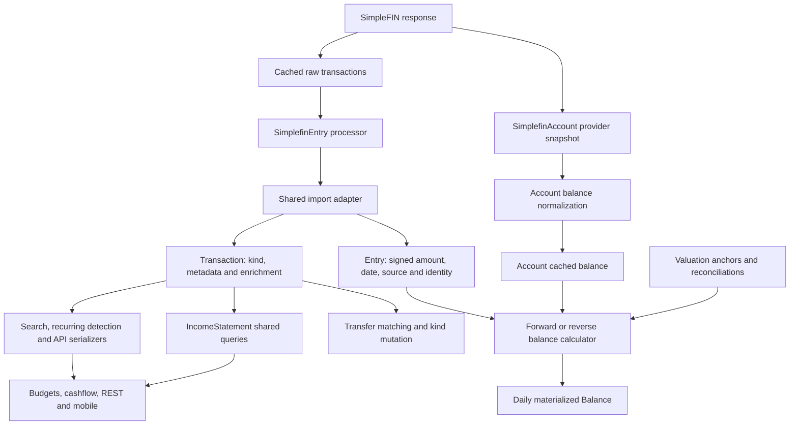

# Liability accounting evidence map

Status: investigation, before architecture selection. Checked 2026-09-26.

Canonical map: [Wayfinder: trustworthy liability accounting from current main](https://github.com/RausserHQ/sure/issues/12).
Research question: [Establish the liability accounting evidence and remaining gap](https://github.com/RausserHQ/sure/issues/13).

External primary-source research: [Upstream history and the SimpleFIN contract](liability-upstream-and-simplefin.md). It records exact merge ancestry, protocol guarantees, linked open work and evidence limits.

## Finding

Current main cannot independently represent the economic meaning of a transaction, its relationship to another account, and its effect on a particular liability quantity. The defect is broader than a reversed sign. **A posted transaction on a Loan is currently assumed to change its non-cash balance by its entire signed Entry amount.** A reporting-kind change neither proves nor changes that arithmetic.

Main already contains useful building blocks: absolute valuations, explicit balance adjustments, transfer relationships and fee components, field-level enrichment locks, provider metadata, read-only ledger diagnostics, and loan projections. Extend these where their meanings fit. Neither the merged upstream fixes nor the production fork supplies the missing independent principal effects and quantity-aware evidence.

This is a source-code investigation. No production account, payload, provider sync or household record was accessed. All numeric examples below are synthetic. The reported private discrepancy is a requirement to explain, not independently verified provider evidence in this document.

## Fixed baselines

| Reference | Commit | Role |
| --- | --- | --- |
| Fork current main | `437c317606497d713a6683f8d8c9a64a17602efd` | Architecture and implementation base |
| Fork production | `aab841bf32492220e24ee7828c648da8c085065f` | Compatibility reference only |
| Upstream v0.7.4 | `1b105efcce7cab8d8c51d29d932f8ea9e624c7cf` | Isolates production customizations from release history |
| Working branch | `wayfinder/liability-accounting` | Created directly from fetched `origin/main` |

The live branch tips were fetched before exploration. Main has 227 commits absent from production; production has 41 absent from main, including release-branch history and fork changes. This count is not a count of unique features: cherry-picked patches can have different commit identities.

## Current data flow and decision points

The missing edges matter: SimpleFIN's stored `balance_date` does not reach a dated anchor through these import paths; no independent principal effect reaches the calculator; and reporting consumers do not all ask one semantic question.

### Provider ingestion and normalization

| Path | Observed behavior | Consequence |
| --- | --- | --- |
| [`SimplefinItem::Importer`](../../app/models/simplefin_item/importer.rb) and [`SimplefinAccount`](../../app/models/simplefin_account.rb) | Cache provider payloads, current/available balances and `balance_date`; transaction snapshots are merged by provider identity. Full, chunked-history and balances-only paths exist. | The latest source evidence exists locally, but these records are not a generic historical balance-observation ledger. |
| [`SimplefinAccount::Processor`](../../app/models/simplefin_account/processor.rb) | Prefers current balance; falls back to available balance when current is nil. Loans use the absolute observed amount. Credit cards use an explicit credit/debt override, then an overpayment heuristic and sign fallback. Linked account type outranks mapper inference. | Application policy supplies liability interpretation. Neither absolute value nor available credit establishes principal or total debt. |
| `SimplefinItem::Importer#import_account_minimal_and_balance` | Contains a second liability balance-normalization path for balances-only imports. | Any correction must converge across both paths. |
| [`SimplefinEntry::Processor`](../../app/models/simplefin_entry/processor.rb) | Negates the provider amount into Entry convention. Chooses a date from transacted/posted fields according to provider account type. Stores pending, descriptive and FX metadata, but no independent principal effect. | A UI sign cannot substitute for the raw provider amount. Display date and balance-effective date are not proven equivalent. |
| [`Account::ProviderImportAdapter`](../../app/models/account/provider_import_adapter.rb) | Finds an Entry by account, external ID and source; can claim manual or pending duplicates; enriches fields; assigns `loan_payment` for a negative amount on any Loan. Explicit provider kind is a fallback after this branch. | Negative payroll on a Loan can acquire payment reporting semantics. A repeat import can rewrite a kind established by matching. |

`SimplefinAccount::Liabilities::LoanProcessor` is currently a placeholder for loan attributes; it does not allocate principal and interest. The CreditProcessor treats positive available balance as available credit, another application interpretation that must not be confused with the quantity anchoring reconciliation.

### Pending, correction and protection

- `SimplefinEntry::Processor.pending?` recognizes an explicit truthy flag or posted epoch zero with a positive transacted timestamp. Absent/blank posted alone is not pending. Import configuration and processing-time filtering both matter.
- The shared adapter first uses account/source/external identity. It can then claim exact-amount/date pending candidates; Plaid also supplies a pending-link ID. Changed amounts can produce suggestions instead of an automatic claim. SimpleFIN does not provide a standard pending-to-posted identity link.
- Claims retain `auto_claimed_pending_ids` and preserve the original pending Entry date. A correction model must retain provider dates separately and specify which date controls balances.
- `Entry#protected_from_sync?` means excluded, user-modified or import-locked. The adapter returns early for these rows, with narrow pending/owned-metadata exceptions. Import ownership, field locks and user modification are distinct protections.
- Provider `extra` is deep-merged by default. Opted-in namespaces can be replaced, removing stale fields. SimpleFIN currently does not opt into replacement. New normalization evidence cannot rely on a deep merge that leaves withdrawn provider facts behind.
- Entry splitting creates children with copied kind/category/merchant and divided amounts, excludes the parent, and does not copy provider source or `extra`. Independent effects require an allocation/conservation rule; copying a full principal effect to every child would double-count it.

Sources: [provider adapter](../../app/models/account/provider_import_adapter.rb), [Entry](../../app/models/entry.rb), [SimpleFIN transaction batch processor](../../app/models/simplefin_account/transactions/processor.rb), [provider guidance](../llm-guides/providers.md).

### Balances, valuations and liability types

| Concept | Current meaning |
| --- | --- |
| `Entry.amount` | Negative cash inflow, positive outflow for transactions; an absolute value for valuations. It is not universally household income/expense or principal delta. |
| `Account.balance_type` | CreditCard is cash; Loan and OtherLiability are non-cash; Investment/Crypto mix cash and holdings. This is not a principal/interest/total-liability taxonomy. |
| Loan subtypes | Mortgage, student, auto, home equity, line of credit, business and other all use the same actual-balance algorithm. |
| `Balance::SyncCache` | Loads posted entries, excludes split parents, converts currencies, and exposes transactions/trades separately from valuations. Ordinary excluded entries are still balance activity; exclusion is not a general zero-balance-effect flag. |
| Forward calculator | Starts from opening balance or a persisted incremental seed; applies transaction amounts; a valuation resets that day's ending balance. |
| Reverse calculator | Starts from current anchor (or cached Account balance and today's date), subtracts flows, and resets at reconciliation valuations. Opening-boundary adjustments explicitly record discrepancies. |
| Loan arithmetic | `BaseCalculator#derive_non_cash_balance` applies all transaction amounts to Loan non-cash balance. Positive increases debt; negative decreases debt. Reporting kind is not consulted. |
| OtherLiability arithmetic | Its non-cash balance does not use the special Loan transaction path. Substituting a universal liability algorithm would change existing behavior. |
| `Valuation` | Absolute amount with opening/current/reconciliation kind. No provider-observation quantity, provider timestamp or interpretation provenance is modeled on the valuation. |
| `CurrentBalanceManager` | Can rotate yesterday's current anchor into a reconciliation, but dates writes with `Date.current`. This mechanism is useful but does not itself consume provider timestamps. |

The actual SimpleFIN full processor and the shared adapter's `update_balance` both call `account.update!` for cached balance fields. They do **not** call `CurrentBalanceManager`. Thus the existence of anchor rotation must not be reported as proof that SimpleFIN retains dated observations. `current_anchor_balance` prefers an existing anchor over cached balance; without an anchor it falls back to cached balance. Both cases require explicit reconciliation rules when changing ingestion.

`Balance` stores flow components and SQL-generated ending balances, not just a chart number. Changes must keep stored `balance`, `end_balance`, flow columns and adjustments consistent. A reset that produces a plausible chart but an inconsistent decomposition is insufficient.

`Balance::ChartSeriesBuilder` uses a date series and the latest prior balance for each account, then substitutes zero when no value exists. Merely omitting uncertain calculated rows would still manufacture a continuous line. `Balance::SeriesAggregator` also sums available values without establishing completeness. The selected gaps policy therefore requires explicit propagation through account charts, aggregate net worth, APIs and mobile; a partial known subtotal cannot be presented as a complete total.

Sources: [Account](../../app/models/account.rb), [base calculator](../../app/models/balance/base_calculator.rb), [forward calculator](../../app/models/balance/forward_calculator.rb), [reverse calculator](../../app/models/balance/reverse_calculator.rb), [sync cache](../../app/models/balance/sync_cache.rb), [materializer](../../app/models/balance/materializer.rb), [anchor manager](../../app/models/account/current_balance_manager.rb), [schema](../../db/schema.rb).

### Existing observation and projection primitives

[`FinancekitBalanceObservation`](../../app/models/financekit_balance_observation.rb) retains immutable source ID, kind, observation timestamp, direction, currency and amount, attached to a provider lineage. The [FinanceKit processor](../../app/models/financekit/processor.rb) identifies repeated observations and records conflicts; only the latest booked observation updates the account. This is a useful source-evidence precedent, but its ownership/protocol model is FinanceKit-specific. Its final adapter call still updates cached Account balance without a dated generic anchor.

[`Loan::AmortizationSchedule`](../../app/models/loan/amortization_schedule.rb), [`Loan::Simulator`](../../app/models/loan/simulator.rb) and [`Loan::RateResolver`](../../app/models/loan/rate_resolver.rb) calculate projected payments and principal/interest breakdowns from original balance, term and recorded rates. Variable rates can cause re-amortization. They do not inspect provider transactions. A scheduled principal allocation cannot be promoted to actual settled principal evidence, especially for revolving credit, extra payments, fees or irregular accrual.

[`AccountStatement#reconciliation_checks`](../../app/models/account_statement.rb) compares statement opening/closing amounts to materialized start/end balances. It has no quantity discriminator, so principal-only and total-liability statements cannot safely be treated as equivalent.

### Transfer lifecycle

| Transition | Current mutation |
| --- | --- |
| Automatic match | Family matcher creates/finds a Transfer, writes inflow `funds_movement`, and chooses outflow kind from destination account. |
| Manual match | `TransferMatchesController` performs the same kind writes and can create a missing counterpart. |
| Rule-created match | `SetAsTransferOrPayment` creates a counterpart and repeats the kind mutation. |
| Transfer creator | Builds legs with payment/movement/contribution kinds. Known fees are separate related ordinary transactions. Includes idempotency and savepoint behavior. |
| Reject/unmatch | Creates rejection evidence when rejecting; `Transfer#destroy!` resets surviving legs to `standard` and clears transfer-creation idempotency keys. |
| Repeat import | Adapter classification can overwrite a matched leg's kind; Transfer membership and kind can disagree. |

The relationship itself is already a separate row, but its lifecycle mutates reporting state. Preserving an original kind only in the automatic matcher is incomplete: manual matching, rules, creator, import correction, destruction callbacks and fee ownership must agree. `Transaction#transfer?` currently answers from transfer-like kinds, whereas `transaction.transfer` finds the paired relationship; these are different questions.

Sources: [Transfer](../../app/models/transfer.rb), [Transferable](../../app/models/transaction/transferable.rb), [automatic matching](../../app/models/family/auto_transfer_matchable.rb), [manual matching](../../app/controllers/transfer_matches_controller.rb), [creator](../../app/models/transfer/creator.rb), [rule action](../../app/models/rule/action_executor/set_as_transfer_or_payment.rb).

### Reporting and external surfaces

| Surface | Current rule / propagation risk |
| --- | --- |
| IncomeStatement | Shared SQL treats loan payments and investment contributions as expenses using absolute amounts. Transfer/card-payment/one-time kinds are excluded. Ordinary negative entries become income. |
| Budgets | Reuse IncomeStatement plus kind filters for recent category transactions. Principal repayment is deliberately included in current budget spending. |
| Cashflow and daily spending | Main has a shared monthly projection, daily totals and Sankey. Aggregate absolute values and category netting require scrutiny for refunds exceeding purchases in a period. |
| Search and rule type filters | Use amount sign plus transfer-kind lists, differing from IncomeStatement's loan-payment rule. Search is also the MCP total/filter source. |
| Recurring detection | Identifier filters transfer kinds and uses negative amounts to identify income; financing/refunds/unresolved credits would need the same semantic query as reporting. Declared recurring obligations remain a distinct product concept. |
| REST transactions | Entry classification is sign-based. Signed cents invert ledger sign into an income-positive presentation. Type filters independently inspect Entry amount. |
| MCP `get_transactions` | Already exposes normalized signed amount, kind, source, pending/excluded state and accessible counterpart data. Classification remains sign-based. Raw provider amount and normalization decisions are absent. |
| Mobile | Transaction parsing currently collapses all non-income classifications to expense. Offline models copy `nature`; chart/list consumers must preserve any expanded meaning. Balance model has amounts/dates but no quantity or certainty. |
| Statements and balance API | Expose or compare materialized values, flows and adjustments without stating which liability quantity was measured or why a history point is defensible. |

Sources: [shared reporting SQL](../../app/models/income_statement/scoped_transactions_query.rb), [IncomeStatement](../../app/models/income_statement.rb), [daily totals](../../app/models/income_statement/daily_expense_totals.rb), [Sankey](../../app/models/income_statement/sankey.rb), [search](../../app/models/transaction/search.rb), [recurring identifier](../../app/models/recurring_transaction/identifier.rb), [REST serializer](../../app/views/api/v1/transactions/_transaction.json.jbuilder), [REST controller](../../app/controllers/api/v1/transactions_controller.rb), [MCP function](../../app/models/assistant/function/get_transactions.rb), [mobile model](../../mobile/lib/models/transaction.dart), [balance API](../../app/controllers/api/v1/balances_controller.rb).

A focused follow-up verified an important integration constraint: the shared reporting SQL aggregates Entry amounts and counts at Entry grain, while search and recurring allocation assume one row per Entry. Adding multiple accounting components through an ordinary join would multiply amounts and counts. A contribution-based design needs an explicit reporting relation below aggregates, with distinct activity counts, while search/recurring retain their Entry-grain interfaces.

## Fork change disposition

Read the issues, PR bodies/reviews and actual production diffs; merged status is not correctness evidence.

| Work | Disposition on main | Reason |
| --- | --- | --- |
| [Expose transaction ledger semantics](https://github.com/RausserHQ/sure/issues/1), [read-only ledger results](https://github.com/RausserHQ/sure/pull/4), [production ledger backport](https://github.com/RausserHQ/sure/pull/6) | Already on main; retain and extend | Lossless signed amount and authorized counterpart visibility are useful. Preserve compatibility and distinguish normalized Entry sign from raw provider sign. |
| [Correct liability and cashflow semantics](https://github.com/RausserHQ/sure/pull/8): financing, refund and unresolved categories | Retain requirements; redesign representation | Economic distinctions are useful, but extending a mutable kind does not separate liability effects. Main now has shared reporting SQL; do not restore production's duplicated queries. |
| Principal regex plus absolute-value sign forcing | Drop as a universal normalization rule | Description wording and account type do not establish raw direction, reversals or principal effect across institutions. |
| [Harden payroll, principal, refund and transfer semantics](https://github.com/RausserHQ/sure/issues/9), [hardening PR](https://github.com/RausserHQ/sure/pull/10): payroll always reduces Loan debt | Drop assumption and replace acceptance case | The current mission corrects this prior requirement. Income and direct principal effect must be separate facts. |
| Narrow refund/payment recognition | Retain conservative intent; redesign boundary | Unknown credits must not automatically become refunds or card payments. Text recognition needs bounded provenance and cannot prove principal arithmetic. |
| Payroll regex in Family matcher | Drop provider-specific domain logic | Ingestion should establish independently preserved meaning; the generic matcher should consume that meaning and relationship eligibility. |
| `transfer_original_kind` and preserving kinds on resync | Retain lifecycle invariant; redesign | Automatic-match-only restoration misses other creation paths and mixes base meaning with relationship changes. |
| REST/MCP/mobile classification propagation | Retain requirement; redesign around one semantic model | The production signed-cents contract makes non-income negative; that is a presentation convention, not provider direction or principal movement. |
| Brex COLLECTION payment recognition | Partly already on main | Main explicitly recognizes COLLECTION payments. Production's other-negative-card-row-is-refund fallback is not generic evidence. |
| Cache invalidation and synthetic regressions | Retain intent; update for main | Changed economic rules must invalidate shared reporting caches; old tests encoding rejected assumptions must be replaced deliberately. |

Any eventual backport must carry the selected domain semantics, migrations, read surfaces and regressions together. None of the accounting patches should be cherry-picked now merely to reproduce production behavior.

## A synthetic counterexample

Assume independent evidence identifies a principal-only balance and establishes these event effects. The normalized ledger amounts below are illustrative; no raw SimpleFIN sign is inferred from their names.

| Activity | Normalized Entry amount | Household report | Principal delta |
| --- | ---: | --- | ---: |
| Advance | 1,000 | Financing | 1,000 |
| Interest | 30 | Expense 30 | 0 |
| Payroll | -500 | Income 500 | 0 |
| Card payment | 200 | Payment/transfer | 0 |
| Repayment | -300 | Principal repayment | -300 |
| Total | 430 | Income 500; expense 30 | 700 |

Opening principal 10,000 must end at 10,700. Current forward Loan arithmetic would end at 10,430. Reversing from the correct 10,700 using the same rows produces 10,270 instead of the true opening 10,000. Kind changes leave the discrepancy intact. Dated resets may hide it at anchor dates while retaining an unsupported path between them.

The correct model must also represent a different loan whose payroll really does reduce principal, capitalized interest that increases principal, and a combined payment with a known principal component smaller than its ledger amount. A missing effect is not evidence of a zero effect.

## Unresolved architecture decisions

1. **Quantity and evidence authority.** How should a provider observation identify principal, accrued interest, total liability, available credit or unresolved meaning? What evidence authorizes conversion to a reconciliation anchor, on which date/time boundary, and with what handling for correction or competing sources?
2. **Independent actual effects and reporting.** Should known component transactions be extended, should Entry own typed balance effects, or should another domain primitive capture them? Evaluate partial amounts, reversals, splits, provenance and SQL reporting before selecting a schema.
3. **Missing evidence and migration.** The user selected observed balance points with gaps for uncertain liability history on 2026-09-26, and separately selected an unresolved bucket excluded from household income/expense totals for uncertain reporting, retaining the old kind for audit. Which histories can migrate deterministically, and what coverage and timing evidence supports reconstruction between observations? Do not synthesize principal effects from old kinds or descriptions.
4. **Transfer meaning.** Preserve independently asserted reporting/effects through every matching path. Decide when matching supplies only a reporting projection and when a known component changes that projection. Prevent both double-counting and payroll loss.
5. **Supported correction workflow.** Define account-level interpretation and transaction-level evidence editing/import boundaries without creating a second finance database or requiring database access. Resync must refresh provider facts and expose protected-field conflicts.

These are dependencies for the implementation graph, not five predetermined schema additions.

## Observability requirements established by the investigation

Extend an application-owned, authorized read path with a bounded allowlist: provider/source and correlation identity; raw amount/dates when retained; normalized Entry amount/date; reporting contribution and provenance; paired transfer role with account-access checks; quantity-specific effect amount or explicit unknown; provider observation quantity/type/date and interpretation; normalization version/reason; pending and protection/conflict state.

Do not serialize all of `extra` or cached raw payloads. Existing MCP access checks and API scopes are the starting points. Balance explanations need an anchor identity, applied effects, explicit residual adjustments and certainty; exposing only a resulting number is inadequate. Existing `DebugLogEntry` supports operational warnings, but is not a substitute for an account-scoped explanation surface.

## Provisional production recommendation

Prefer moving production to a reviewed newer base before this architecture. Current main adds loan schedule/rate engines, shared income queries, cashflow endpoints, new recurring/bills behavior, more import protection and transfer idempotency/FX rules. Production's patches target older versions of those interfaces. Porting a selected domain model backward could be feasible, but maintaining two implementations and migrations is a material risk.

This is not yet a final backport verdict: decide after the architecture and diff are fixed. Small independent observability improvements may remain safe backports. The principal accounting change should not be constrained by v0.7.4. The later deployment effort must validate image/base compatibility, sync normally, inspect protected conflicts, apply only deterministically justified repairs and compare private provider evidence. This source effort does none of those production actions.

## Validation status and next gate

Evidence came from current source, schema, existing test source, Git ancestry, GitHub history and primary protocol research. No new accounting behavior has been implemented or claimed tested. Local host Ruby is 2.6.10; the project requires 3.4.9 and Bundler 2.6.7. The user explicitly authorized the isolated synthetic test environment under `/tmp/sure-wayfinder/compose.test.yml`, including schema loads and test migrations. Its container build, dependencies and schema load succeeded. Docker disk exhaustion required a task-specific host directory for PostgreSQL and disabling persistence for disposable test Redis; no existing Docker data was deleted. Direct libpq test credentials and a read-only Git metadata mount resolved the remaining container configuration differences.

An independent validator ran the unchanged main application baseline with `docker compose -p sure-liability-test -f /tmp/sure-wayfinder/compose.test.yml run --rm -e DISABLE_PARALLELIZATION=true tests bin/rails test`: **9,798 runs, 41,386 assertions, zero failures, zero errors, 33 skips**, exit 0 in 414 seconds. This establishes the baseline, not validation of the proposed model. The captured local log is `/tmp/sure-wayfinder/baseline-tests-corrected.log`.

The eventual acceptance suite must cover mixed effects, reversals, combined payment components, every transfer lifecycle path, idempotent and corrected imports, pending settlement, protected records, splits, quantities/currencies/dates, observed versus inferred histories, report/refund totals, REST/MCP authorization and precision, mobile parsing, and preservation of existing unrelated account behavior. The repository's full pre-PR gates remain required before a source PR.
